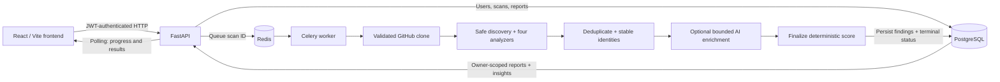

# CodeSentry

**Python repository analysis with deterministic findings, explainable priorities, and optional AI-assisted review.**

Static-analysis tools can generate large amounts of undifferentiated noise. CodeSentry combines four analyzers with Top Issues, file hotspots and scan comparison to help developers decide what to address first. Optional AI explanations provide context and practical fixes while the analyzers remain authoritative.

This portfolio project has a tested local release candidate. It is **not production-ready** for public, untrusted, multi-tenant use.

[Setup](#local-development) · [Architecture](#architecture) · [API](#api-overview) · [Engineering evidence](#supporting-documentation)

## Features

- **Public GitHub scans:** bounded, shallow cloning of Python repositories; repository code is parsed, never executed.
- **Four analyzers:** Radon complexity, custom AST security checks, Vulture dead-code candidates and a custom style rule for long parameter lists.
- **Useful findings:** deduplicated category, severity, title, message, location/snippet where available and actionable analyzer fixes.
- **Deterministic health score:** 0–100 with diminishing penalties, avoiding immediate collapse from many minor findings.
- **Prioritization / Top Issues:** explainable review order using severity, security relevance, complexity, analyzer confidence and path context.
- **Search and filters:** compose text, severity, category and comparison state; reset together. Selecting a hotspot filters by exact file.
- **File hotspots:** severity composition and weighted concentration, with capped low/info contributions.
- **Scan comparison:** preceding completed scan of the same repository/owner; score/severity deltas and new/resolved/unchanged findings.
- **Persistent history:** saved metadata and reports survive refresh/restarts; zero is a valid score.
- **Progress / ETA:** preparation, static analysis, AI review and finalization; approximate workload-based ranges on creation, history and results views.
- **Optional AI advice:** bounded explanations/fix suggestions with analyzer fallback when credentials/provider are unavailable.
- **Auth and asynchronous execution:** Argon2, owner-scoped JWT APIs, Redis/Celery, duplicate-task protection and failure recovery.
- **Resource/security safeguards:** strict URLs, safe file reads, workload/time limits, sanitized errors and temporary-workspace cleanup.

## Screenshots

**Placeholders — owner captures are pending.** These are planned paths, not existing images or fabricated screenshots.

| Suggested capture | Planned location |
| --- | --- |
| Dashboard: repository, score and counts | `docs/screenshots/dashboard.png` |
| Genuine scan progress: stage and approximate window | `docs/screenshots/scan-progress.png` |
| Completed report and Top Issues | `docs/screenshots/completed-report.png` |
| Issue details: evidence, snippet, priority reasons, fix | `docs/screenshots/issue-detail.png` |
| Hotspot selection and composed filters | `docs/screenshots/hotspots-filtering.png` |
| Comparison: baseline and genuine deltas | `docs/screenshots/scan-comparison.png` |

[Capture checklist](docs/screenshots/README.md). Existing release screenshots remain engineering evidence, including labeled fixtures; they are not substituted for portfolio captures.

## Architecture



GitHub supports [Mermaid Markdown diagrams](https://docs.github.com/en/get-started/writing-on-github/working-with-advanced-formatting/creating-diagrams).

| Component | Role |
| --- | --- |
| React / Vite | Sign-in, polling, history and interactive reports |
| FastAPI | Request/JWT validation, ownership, queueing and report APIs |
| PostgreSQL / SQLAlchemy | Persistent users, repositories, scans and issues |
| Redis | Celery message broker; reports remain in PostgreSQL |
| Celery | Repository preparation, analysis, enrichment, persistence and cleanup |
| Docker Compose | Local backend services; frontend runs separately |
| Analyzers | Rule-grounded evidence, severity and fixes |
| AI reasoner | Structured, advisory explanations for supplied findings |

[Architecture and technical decisions](docs/architecture.md) covers algorithms, configuration, migrations and failure handling.

## Analysis pipeline and decisions

1. Validate the raw GitHub HTTPS URL, authorize the owner, persist a queued scan and publish its ID.
2. Atomically claim work; clone under limits without repository hooks, inherited Git credentials or shell execution.
3. Safely discover/read eligible `.py` files, excluding generated/vendor/environment trees, links and non-regular files.
4. Run complexity, security, dead-code and style analysis concurrently; deduplicate by rule/location with stable severity handling and comparison identities.
5. Optionally enrich up to 24 findings in three bounded AI batches. AI cannot add/remove findings or decide severity, priority, score, hotspots, comparison or authorization.
6. Finalize the deterministic score, persist findings/status and clean temporary files. The API derives report insights/comparison; the frontend polls results.

Celery/Redis keep repository processing outside HTTP requests. Deterministic calculations make results explainable and repeatable for the same source/rules. Bounded, fallback-safe AI limits latency/cost while retaining analyzer results. Structural fingerprints prevent message/whitespace edits from manufacturing scan changes; legacy reports use a disclosed conservative fallback.

## Security and limits

URLs, repository files, analyzer output and AI input are untrusted. Protections include strict GitHub host/scheme validation, no repository execution, restricted Git arguments/environment, symlink/traversal-resistant reads, owner isolation, JWT expiry/subject validation, Argon2 hashing, sanitized errors, heuristic secret redaction and cleanup. AI receives bounded data without tools; its advice requires verification.

Current safeguards: **120 s** preparation, **512 MiB / 50,000** checkout entries, **5,000** Python files, **1,000,000 bytes/file**, **100,000,000 source bytes**, **20,000** directories, **50,000** combined findings and **270/300 s** soft/hard task limits. Caps can cause skipped source or intentional failures; they do not guarantee complete coverage or completion.

[Security audit](docs/security-hardening.md) · [Production release gates](docs/release-candidate-report.md#6-documentationdeployment-readiness-and-blockers). Compose's local database credentials and root worker are not a production security setup.

## Verified examples

**Examples, not performance guarantees.** On 2026-09-29, real clones/analyzers with Python 3.12 and isolated SQLite persistence, AI disabled, produced:

| Repository | Eligible Python files | Findings | Score | Full benchmark time |
| --- | ---: | ---: | ---: | ---: |
| Requests | 37 | 25 | 68/100 | 4.64 s |
| Django | 2,932 | 419 | 40/100 | 140.68 s |

These historical benchmarks invoked tasks directly, without broker delivery. [Recorded commits/timings/counts](docs/analysis-quality.md#results--2026-09-29) and [raw data](docs/analysis-benchmarks-2026-09-29.json) preserve their method/rule snapshot. Source, hardware, network and contention affect runtime.

The subsequent release-candidate pass verified **frontend → API → Redis → Celery → PostgreSQL → results**: Requests yielded 25 findings, score 68 and **5.82 s** worker processing. Identical scans showed **0 new / 0 resolved / 25 unchanged**; a separately labeled temporary source change verified new/resolved detection without manufacturing results.

## Local development

### Prerequisites

Docker with Compose, Node.js 20+/npm (verified with Node 24.16.0), network access to public GitHub, and free ports 8000/5173/5432/6379. The backend image supplies Python 3.12, Git and dependencies. AI additionally requires your own provider key and available model.

### 1. Environment setup

From the repository root, preserve an existing `.env`:

```sh
test -e .env || cp .env.example .env
openssl rand -hex 32
```

Paste the generated value into `JWT_SECRET` in `.env`; never commit it. A shared explicit key keeps sessions stable across restarts. Blank development keys are process-local/random. Keep `ENVIRONMENT=development` and `CORS_ORIGINS=http://localhost:5173` locally.

Leave `ANTHROPIC_API_KEY` blank for analyzer-only scans. To enable AI, supply your key and an `ANTHROPIC_MODEL` available to your account; successful live-provider/model operation remains unverified.

Compose supplies its own PostgreSQL/Redis URLs and scan-root/allowlist settings. Editing the corresponding native/default entries in `.env.example` does not override Compose. [Configuration reference](docs/architecture.md#configuration-and-local-runtime).

### 2. Backend services

```sh
docker compose up -d --build
docker compose ps
curl --fail http://localhost:8000/api/health
```

Health reports API liveness, not database/broker/worker readiness. Local URLs:

- Frontend after the next step: http://localhost:5173
- API: http://localhost:8000; no application page at its root.
- Swagger: http://localhost:8000/docs
- OpenAPI: http://localhost:8000/openapi.json

### 3. Frontend

In another terminal, from the repository root:

```sh
cd frontend
npm ci
npm run dev -- --host 127.0.0.1 --port 5173 --strictPort
```

The browser API defaults to `http://localhost:8000`. For another API, set `VITE_API_URL` in ignored `frontend/.env.local`, restart Vite and configure backend CORS for the exact frontend origin. `VITE_` variables are public; never place provider/signing secrets there.

### 4. First scan

The frontend has sign-in but no registration form. Register through Swagger's `POST /api/auth/register` with your own email and strong password (8–128 characters), then sign in through the frontend. Swagger Authorize uses email as `username`. No seeded credentials are required.

Scan `https://github.com/psf/requests`, explore the report and scan it again to view comparison.

### Tests and production build

From the repository root, rebuild the test image after backend/configuration changes and run the complete suite:

```sh
docker compose build api
docker compose run --rm api pytest -q
```

The image includes `backend/pytest.ini`, which adds the backend root to pytest's import path. Both `pytest` and `python -m pytest` work without manual `PYTHONPATH` flags. The suite uses isolated test databases and mocks; `docker compose run --rm --no-deps api pytest -q` also works without starting PostgreSQL/Redis. The native `make test` helper remains available with backend dependencies installed.

Frontend checks, from the root in another terminal after `npm ci`:

```sh
cd frontend
npm test
npm run build
```

`npm test` uses the existing Node.js built-in test runner; no additional framework is required. Do not append Vitest's `--run` flag.

Verified baseline: **93 backend tests, 7 frontend tests**, production build and genuine PostgreSQL E2E. The [release report](docs/release-candidate-report.md) covers auth, isolation, failures/cleanup, comparison and responsive/refresh behavior; production load, successful live AI and a real 300-second deadline remain unverified.

### Rebuild and shutdown

Backend source is copied into images. From the root:

```sh
docker compose up -d --build api worker
docker compose logs --tail=100 api worker
docker compose down
```

Stop Vite with Ctrl+C. `down` preserves named volumes/history. For existing databases, drain active work and let one updated API finish additive migrations **before** starting updated workers; [migration notes](docs/architecture.md#persistence-and-migrations). Do not remove volumes if you want to retain history.

## Project structure

```text
codesentry-starter/
├── README.md
├── .env.example
├── docker-compose.yml
├── backend/
│   ├── Dockerfile, requirements.txt
│   ├── app/
│   │   ├── api/          # Auth, scan, history and comparison routes
│   │   ├── analyzers/    # Four deterministic analyzers
│   │   ├── ai/           # Bounded advisory reasoner
│   │   ├── services/     # Safe ingestion, score, identity and reporting
│   │   └── tasks/        # Celery lifecycle and cleanup
│   ├── tests/
│   └── scripts/          # Isolated benchmark/verification harnesses
├── frontend/
│   ├── src/pages/, components/, api/
│   ├── tests/
│   └── package-lock.json
└── docs/                 # Decisions, evidence and screenshot placeholders
```

## API overview

[OpenAPI](http://localhost:8000/openapi.json) is the executable contract. Scan endpoints require `Authorization: Bearer <your-token>`.

| Endpoint | Behavior |
| --- | --- |
| `POST /api/auth/register` | JSON email/password; bearer token, 201 |
| `POST /api/auth/login` | Form-encoded username (email)/password; bearer token |
| `POST /api/scans` | JSON repo_url; scan_id, status/stage and estimate fields, 202 |
| `GET /api/scans` | Owner history page: items/total/limit/offset; limit 1–500, offset 0–1,000,000, optional status |
| `GET /api/scans/{scan_id}` | Metadata, lifecycle, score, issues, Top Issues and hotspots |
| `GET /api/scans/{scan_id}/comparison` | Earlier completed same-repository/owner comparison; 409 for incomplete current scan |
| `GET /api/health` | Public API liveness |

Scan IDs are positive signed 32-bit integers. Unknown/other-owner scans return 404; invalid input 422; active-scan admission 429; queue failure 503 with a persisted failed scan. First scans return unavailable comparison with a reason. Logout clears the client token; no revocation/logout API. Findings come within scan detail; progress uses HTTP polling, not WebSockets.

## Known limitations / remaining work

- Python-only, public GitHub HTTPS ingestion; no uploads, private credentials, other hosts or branch/commit selection.
- Static false positives/negatives, heuristic redaction and partial coverage from caps/skipped files/analyzer failures. No complete dependency/data-flow/cross-language audit or full coverage diagnostics. A high score is not proof of security.
- AI reviews a bounded subset and may give incorrect advice; verify fixes.
- URL-based comparison is conservative for legacy reports, moves/renames, semantic/rule changes and repeated occurrences.
- Full reports load client-side; history shows up to the first 500 returned scans, with more available through API pagination/direct URLs.
- Process-local auth throttling, localStorage tokens, no revocation/distributed global quotas.
- Production work: HTTPS/secrets/private database/broker access, non-root worker isolation/hard quotas, periodic recovery, dependency review, monitoring and staging capacity/backup validation.

These are deferred work, not implemented claims. The owner must supply a public repository URL, any deployed-demo URL, portfolio screenshots and a chosen license before publication; none is supplied here.

## Supporting documentation

- [Architecture and technical decisions](docs/architecture.md)
- [Analysis rules, score formula and benchmarks](docs/analysis-quality.md)
- [Priority, hotspots, filtering, comparison and migrations](docs/product-features.md)
- [Security audit and production recommendations](docs/security-hardening.md)
- [Release-candidate regression report](docs/release-candidate-report.md)
- [Screenshot checklist](docs/screenshots/README.md)
- [Documentation verification and owner handoff](docs/documentation-review.md)

Older reports retain dated measurements/test counts; the release report records the current functional baseline.
